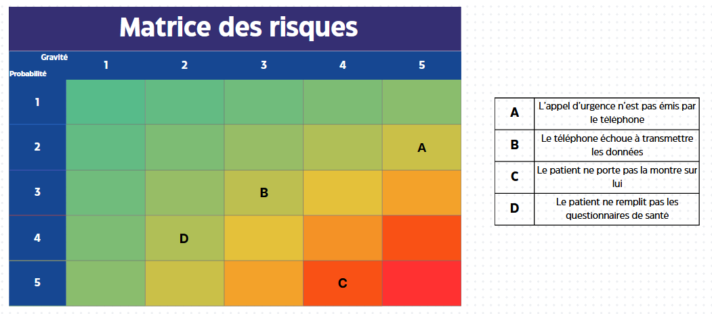

# Matrice des risques

# Bowties

## Risque 1 : Mauvaise configuration par le patient ou sa famille

Ce risque se concentre uniquement sur l'erreur humaine lors de l'installation.

**Événement à risque :** Mauvaise configuration par le patient ou sa famille.

**Causes :** Le patient et/ou sa famille ne comprennent pas le fonctionnement ou la configuration de la technologie.

**Barrières de Prévention :** Pour empêcher cela, les infirmiers sont formés pour pouvoir configurer les capteurs (montre, téléphone) dans le cas où ça n'a pas pu être fait par les proches.

**Conséquences :** Les capteurs ne sont pas connectés à l'application.

**Mesures de Prévention :**
- Si l'événement se produit, une alerte est envoyée au personnel médical lors de la première visite programmée, lui demandant de configurer les capteurs lorsqu'il essaie de visionner les données du patient.

## Risque 2 : Le patient ne remplit pas les questionnaires

Ce risque concerne l'utilisation quotidienne de l'application par le patient.

**Événement à risque :** Patient ne remplit pas les questionnaires.

**Causes :** Oubli, refus, perte de motivation.

**Conséquences :** Données incomplètes → suivi médical faussé.

**Mesures de Prévention :**
- Notifications automatiques + rappel aux proches.
- Ajouter des relances multiples + simplification maximale du questionnaire.

## Risque 3 : L'appel d'urgence n'est pas émis par le téléphone

Risque critique où le téléphone ne parvient pas à contacter les secours suite à une alerte.

**Événement à risque :** L'appel d'urgence n'aboutit pas.

**Causes :** 
- Zone blanche / Absence de réseau cellulaire (un appel d'urgence a besoin d'un signal, même minimal).
- Bug logiciel sur le téléphone qui empêche le déclenchement de l'appel.
- Batterie du téléphone vide.

**Conséquences :** Patient non secouru, menant à un risque vital.

**Mesures de Prévention :**
- Affichage permanent de l'état du réseau dans l'application.
- Vérification régulière de l'état de la batterie avec notifications au patient et aux proches si le niveau est critique.
- Mise en place d'un mode "économie d'énergie d'urgence" : en dessous d'un seuil critique, l'application arrête la synchronisation des données et préserve la batterie pour les fonctions vitales.
- Mise en place de tentatives d'appels multiples et automatiques.
- Envoi automatique d'un SMS d'urgence (qui peut parfois passer avec un signal très faible) aux secours et/ou aux contacts désignés.
- Déclenchement d'une alarme sonore locale et puissante sur le téléphone pour alerter toute personne à proximité.

## Risque 4 : Le patient ne porte pas ses capteurs

Ce risque est lié à l'utilisation quotidienne des capteurs par le patient.

**Événement à risque :** Le patient ne porte pas ses capteurs.

**Causes :** Oubli, refus, perte de motivation.

**Conséquences :** Manque de données.

**Mesures de Prévention :**
- Notification pour lui indiquer qu'il ne porte pas ses capteurs.
- Mesures de Récupération (pour atténuer les conséquences).
- Ajouter des relances multiples.

## Risque 5 : Matériel défaillant ou incompatible

Ce risque regroupe les pannes de capteurs et les problèmes de compatibilité du téléphone.

**Événement à risque :**
- Capteur en panne (ex : montre, glucose). 
- Téléphone incompatible.

**Causes :**
- Batterie vide
- Casse du matériel
- Bug du capteur
- Version du smartphone du patient incompatible

**Mesures de Prévention :** Pour anticiper ces problèmes, des alertes de non-remontée de données sont prévues, ainsi que la fourniture d'une liste des téléphones compatibles en amont.

**Conséquences :** Il en résulte une absence de données vitales (le médecin est mal informé) ou l'impossibilité totale d'installer/utiliser l'application.

**Mesures de Prévention :** Pour y remédier, une vérification automatique des capteurs avec notification au patient/proche est mise en place.
Dans le cas d'un téléphone non compatible, la mesure est la prescription d'un téléphone compatible.

## Risque 6 : Données non transmises par le téléphone ou lenteur réseau

Ce risque est lié à la connectivité et à la transmission des données.

**Événement à risque :** Données non transmises par le téléphone ou lenteur réseau.

**Causes :**
- Zone blanche
- Connexion lente
- Problème réseau

**Conséquences :**
- Données en retard ou non transmises.
- Barrières de Prévention.
- Buffer côté capteur / téléphone.

**Mesures de Prévention :**
- Prévoir un stockage local + une synchronisation différée dès le retour du réseau.
- Affichage d'un signe pour indiquer que les données ne sont pas sauvegardées et qu'il est préférable que le téléphone reste allumé.
- Affichage d'un signe pour dire que les données affichées sur l'application ne sont pas à jour.

## Risque 7 : Perte ou Vol du téléphone du patient

Ce risque se concentre sur la sécurisation des données et la continuité du service, en supposant que l'utilisateur n'est pas un expert en technologie.

**Événement à risque :** Le téléphone du patient est perdu ou volé.

**Causes :**
- Négligence
- Oubli
- Vol

**Conséquences :**
- Accès non autorisé aux données de santé sur l'appareil par un tiers (si l'application n'est pas protégée).
- Interruption du suivi médical car le terminal de collecte n'est plus disponible.

**Mesures de Prévention :**
- Verrouillage de l'application : L'accès aux données de santé dans l'application nécessite une authentification simple (un code PIN facile à retenir, ou si possible, l'empreinte digitale). Cela protège les données même si l'écran du téléphone n'est pas verrouillé.
- Sauvegarde automatique des données : Les données collectées sont régulièrement et automatiquement synchronisées avec un serveur sécurisé. Le patient n'a rien à faire.
- Procédure de réinstallation simplifiée : La famille ou le personnel soignant peut facilement installer l'application sur un nouveau téléphone.
- Restauration facile du compte : En se connectant avec son identifiant, toutes les données précédemment sauvegardées sont automatiquement restaurées sur le nouvel appareil, assurant une continuité du suivi.
- Déconnexion de l'ancien appareil : La connexion sur le nouvel appareil entraîne automatiquement la déconnexion de l'ancien téléphone pour sécuriser le compte.

## Risque 8 : Cyberattaque sur le compte du patient

L'objectif est de protéger le compte sans imposer de contraintes techniques complexes à l'utilisateur.

**Événement à risque :** Un acteur malveillant obtient l'accès au compte du patient.

**Causes :**
- Divulgation accidentelle des identifiants (par exemple, en répondant à un email frauduleux).
- Utilisation d'un mot de passe trop simple et facile à deviner.
- Compromission générale du téléphone par une autre application.

**Conséquences :**
- Vol et fuite de données de santé sensibles.
- Modification ou suppression des données, faussant le suivi médical.

**Mesures de Prévention :**
- Chiffrement automatique et invisible : Toutes les données qui transitent entre le téléphone et les serveurs sont chiffrées par défaut. L'utilisateur n'a rien à activer.
- Déconnexion automatique : L'application se déconnecte automatiquement après une certaine période d'inactivité pour protéger les données si le téléphone est laissé ouvert.
- Notification de connexion : Un e-mail est automatiquement envoyé au patient si une connexion a lieu depuis un nouvel appareil, lui permettant de réagir s'il ne reconnaît pas l'action.
- Support accessible : Mise à disposition d'un numéro de téléphone ou d'un contact d'aide clair pour signaler tout problème et obtenir de l'assistance pour sécuriser le compte.
- Déconnexion de tous les appareils : Le support technique (ou un proche aidant) peut forcer la déconnexion de tous les appareils liés au compte pour bloquer un accès non autorisé.

## Risque 9 : Surcharge de la file d'attente MQTT

Ce risque concerne l'engorgement du système qui reçoit les données brutes des capteurs.

**Événement à risque :** La file d'attente (queue) MQTT est saturée ou ne peut plus traiter les messages entrants.

**Causes :**
- Pic de connexions simultanées : Un grand nombre d'appareils se connectent en même temps (ex: après une panne de réseau généralisée).
- Volume de données inattendu : Un bug sur les capteurs les fait envoyer des données beaucoup trop fréquemment.
- Consommateur lent ou en panne : Le service qui lit les messages dans la queue est ralenti ou ne fonctionne plus, créant un embouteillage.

**Conséquences :**
- Perte de données de santé récentes, car les nouveaux messages sont rejetés.
- Retard important dans la mise à jour des données, rendant le suivi médical inefficace.
- Instabilité générale du système pouvant mener à une panne complète.

**Mesures de Prévention :**
- Persistance des messages : Configurer la file d'attente pour qu'elle stocke les messages sur le disque si elle est surchargée (dead-letter queue), permettant de les retraiter plus tard.
- Redémarrage prioritaire : Procédure pour redémarrer rapidement les services consommateurs qui seraient en panne.
- Auto-scaling des consommateurs : Déployer automatiquement de nouvelles instances du service de traitement lorsque la taille de la file d'attente dépasse un certain seuil.
- Limitation de débit (Throttling) : Refuser temporairement les connexions ou les messages d'un appareil qui en envoie une quantité anormale.
- Monitoring et alertes : Mettre en place des alertes qui se déclenchent lorsque la file d'attente atteint un niveau de remplissage critique.

## Risque 10 : Surcharge de l'API REST

Ce risque concerne la partie du système utilisée par les médecins, les proches ou les patients pour consulter les données.

**Événement à risque :** Le serveur de l'API REST ne répond plus aux requêtes ou répond avec une latence très élevée.

**Causes :**
- Requêtes complexes et simultanées : Plusieurs médecins demandent en même temps des historiques de données sur de longues périodes.
- Nombre élevé d'utilisateurs connectés : Un afflux d'utilisateurs (ex: lors d'une campagne d'information) se connecte en même temps.
- Attaque par Déni de Service (DDoS) : Un acteur malveillant inonde l'API de requêtes pour la rendre indisponible.

**Conséquences :**
- Impossibilité pour le personnel soignant d'accéder aux données vitales des patients.
- Frustration et perte de confiance des utilisateurs (famille, patients).
- Indisponibilité totale de l'interface de consultation.

**Mesures de Prévention :**
- Mise en cache (Caching) : Conserver en mémoire les résultats des requêtes fréquentes (ex: les données des dernières 24h) pour ne pas avoir à les recalculer à chaque fois.
- Pagination des résultats : Obliger la demande des données par "pages" (ex: 100 résultats à la fois) pour éviter les requêtes qui extraient des mois de données d'un seul coup.
- Load Balancing : Répartir les requêtes entrantes sur plusieurs serveurs pour qu'aucun ne soit surchargé.
- Protection DDoS : Utiliser des services spécialisés pour filtrer le trafic malveillant avant qu'il n'atteigne le serveur.
- Auto-scaling des serveurs web : Démarrer automatiquement de nouveaux serveurs pour gérer un pic de trafic.
- Mode "lecture seule" dégradé : Si la base de données est surchargée, basculer l'API dans un mode où elle ne sert que des données en cache, sans permettre de modifications.

## Risque 11: Vulnérabilité dans une librairie tierce

Ce risque traite des scénarios où une tierce partie dans le code de l'application a une faille de sécurité.

**Événement à risque :** Une faille de sécurité est découverte et exploitée dans une librairie externe utilisée par l'application.

**Causes :**
- "Zero-day" exploit : Une attaque a lieu avant que la faille ne soit publiquement connue.
- Dépendance non maintenue : L'équipe de développement n'a pas mis à jour une librairie après la publication d'un correctif de sécurité.
- Dépendance transitive : Une librairie que vous utilisez dépend elle-même d'une autre librairie vulnérable, rendant la faille difficile à détecter.

**Conséquences :**
- Accès non autorisé au serveur ou à la base de données.
- Vol massif ou corruption des données de santé des patients.
- Prise de contrôle du service, le rendant indisponible ou malveillant.

**Mesures de Prévention :**
- Procédure de patch d'urgence : Un plan pour appliquer le correctif de sécurité et redéployer l'application en priorité absolue.
- Restauration depuis une sauvegarde : Isoler le système compromis et restaurer les données et le code depuis une sauvegarde saine effectuée avant l'attaque.
- Audit post-incident : Analyser comment l'attaque a eu lieu pour renforcer les défenses et éviter qu'elle ne se reproduise.
- Analyse automatisée des dépendances : Utilisation d'outils (comme Dependabot, Snyk) qui scannent en continu le code pour identifier les librairies vulnérables connues.
- Politique de mise à jour stricte : Mettre en place un processus régulier pour tester et appliquer les mises à jour de sécurité sur toutes les dépendances.
- Pare-feu applicatif (WAF) : Configurer un pare-feu pour bloquer les types d'attaques les plus courants qui exploitent ces failles (ex: injection SQL, XSS).

## Risque 12: Echec du service d'encryption

Ce risque concerne un échec dans le système responsable de l'encryption des données, que ce soit dans le management des keys ou dans l'encryption en elle-même.

**Événement à risque :** Le service d'encryption devient indisponible ou corrompu.

**Causes :**
- Perte irréversible des clés de chiffrement : Suppression accidentelle, corruption du fichier de clés, ou absence de sauvegarde.
- Mauvaise configuration du service : Erreur humaine lors du déploiement ou de la mise à jour du service d'encryption.
- Panne matérielle ou logicielle du service de gestion des clés (HSM ou service cloud comme AWS KMS).

**Conséquences :**
- Données inaccessibles de manière permanente : Si les clés sont perdues, les données chiffrées sont inutilisables, équivalant à une perte totale.
- Violation de la conformité (RGPD) : Si des données sensibles sont stockées en clair suite à une panne du service.
- Indisponibilité totale de l'application, car elle ne peut ni lire ni écrire de données de manière sécurisée.

**Mesures de Prévention :**
- Plan de reprise d'activité (Disaster Recovery) : Une procédure documentée et testée pour restaurer les clés de chiffrement à partir d'une sauvegarde sécurisée.
- Clés de secours : Maintenir des copies chiffrées des clés de chiffrement dans un emplacement "froid" (hors ligne et hautement sécurisé).
- Gestion sécurisée des clés (Key Management) : Utiliser un service dédié et robuste (HSM, KMS) avec des politiques de rotation et de sauvegarde automatiques des clés.
- Redondance du service : Avoir une infrastructure redondante (ex: multi-région) pour le service d'encryption afin qu'une panne locale ne soit pas un point de défaillance unique.
- Monitoring et alertes : Superviser en permanence la santé du service d'encryption pour détecter toute anomalie avant qu'elle ne devienne critique.

# Bowties visuels par cause

[Erreur humaine](./images/bowties/erreur_humaine.pdf) 

[Erreur réseau](./images/bowties/perte_de_reseau.pdf) 

[Sécurité des données](./images/bowties/data_security.pdf) 

[Défaillance logicielle ou matérielle](./images/bowties/def_logicielle_ou_mat.pdf) 

[Surcharge de l’infrastructure](./images/bowties/surcharge_infra.pdf)

